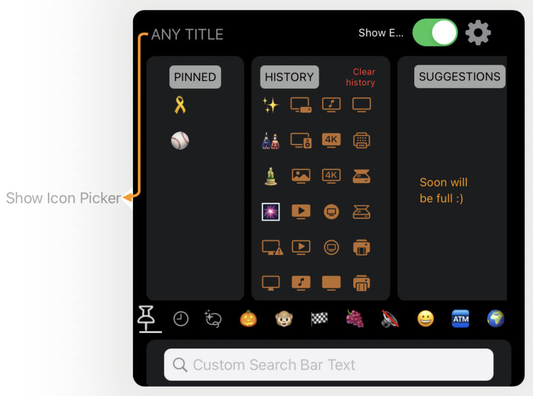
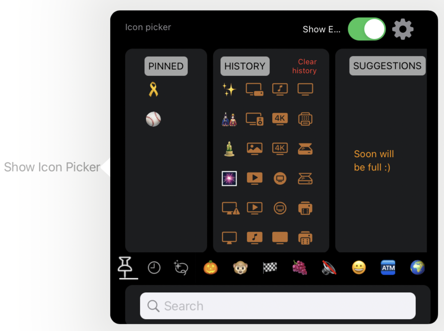

# IconPicker
Full SwiftUI icon picker
=======

IconPickerView(
    iconTapAction: self.setNewIcon,
    searchFieldTitle: "Custom Search Bar Text",
    headerView: AnyView(Text("ANY TITLE").offset(x:5, y: 12)),
    triggerSizeAndCoordinates: CGRect(x: 50.0, y: 350.0, width: 50.0, height: 0.0),
    connectorColor: .orange
)

