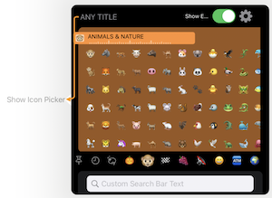
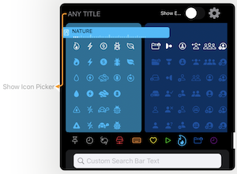
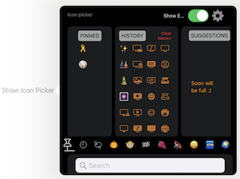
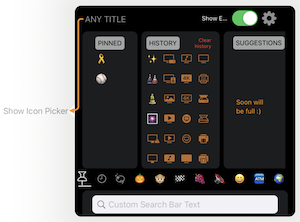

# IconPicker
Full SwiftUI icon picker
=======




## Features
* tapped icon runs a function passed from your app (the only required parameter)
*  2 sets of icons - Emojis and SF Symbols
*  History pane with 24 last used icons
* Pinned pane with your favourite icons (press long to add it to the pane)
* Text search from both icons sets
* Customize the following settings:
    - header can be any SwiftUI view
    - connector arrow position when IconPicker displayed in a popup and needed to be visually connected with the trigger
    - connector line color
    - search bar text

## Installation
Installation through the Swift Package Manager (SPM): select your project (not the target) and then select the Swift Packages tab. Click + and type IconPicker - SPM should find the package on github.


Make sure to import IconPicker in every file where you use IconPicker.
```Swift
    import IconPicker
```
    
    
## Basic usage code example
```Swift
import SwiftUI
import IconPicker

struct IconPickerPlayground: View {
    
    func setNewIcon(iconName: String) -> Void {
        print(iconName)
    }
    
    var body: some View {
                            IconPickerView(
                            iconTapAction: self.setNewIcon,
                            searchFieldTitle: "Custom Search Bar Text",
                            headerView: AnyView(Text("ANY TITLE").offset(x:5, y: 12)),
                            triggerSizeAndCoordinates: CGRect(x: 50.0, y: 350.0, width: 50.0, height: 0.0),
                            connectorColor: .orange
                        )
    }
}
```
The code above produces this view:



## All parameters code example

```Swift
import SwiftUI
import IconPicker

struct IconPickerPlayground: View {
    
    func setNewIcon(iconName: String) -> Void {
        print(iconName)
    }
    
    var body: some View {
                            IconPickerView(
                            iconTapAction: self.setNewIcon,
                            searchFieldTitle: "Custom Search Bar Text",
                            headerView: AnyView(Text("ANY TITLE").offset(x:5, y: 12)),
                            triggerSizeAndCoordinates: CGRect(x: 50.0, y: 350.0, width: 50.0, height: 0.0),
                            connectorColor: .orange
                        )
    }
}
```
   
The code above produces this view:



